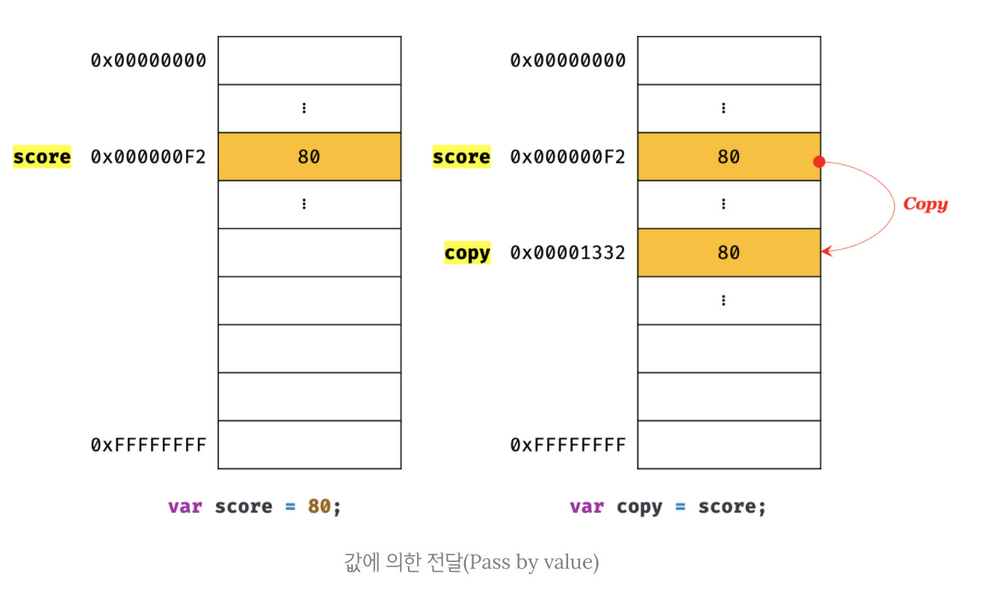
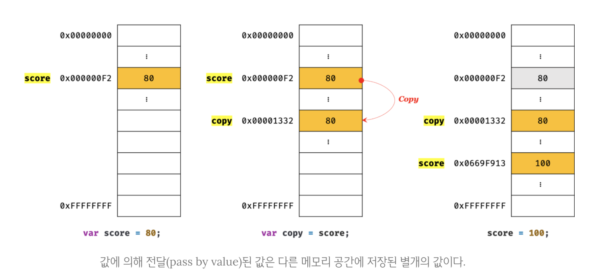
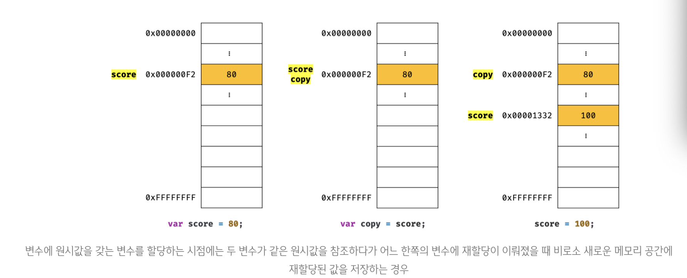

# 11. 원시값과 객체의 비교

자바스크립트가 제공하는 7가지 데이터 타입은 크게 원시 타입(primitive type)과 객체(object / reference type)타입으로 구분함. 원시 타입과 객체 타입은 크게 세 가지 측면에서 다름.

- 원시 타입의 값, 즉 원시값은 변경 불가능한 값(immutable value)이다. 이에 비해 객체(참조) 타입의 값, 즉 객체는 변경 가능한 값(mutable value)이다.
- 원시값을 변수에 할당하면 변수(확보된 메모리 공간)에는 실제 값이 저장된다. 이에 비해 객체를 변수에 할당하면 변수(확보된 메모리 공간)에는 참조값이 저장된다.
- 원시값을 갖는 변수를 다른 변수에 할당하면 원본의 원시값이 복사되어 전달된다. 이를 값에 의한 전달(pass by value)이라 한다. 이에 비해 객체를 가리키는 변수를 다른 변수에 할당하면 원본의 참조값이 복사되어 전달된다. 이를 참조에 의한 전달(pass by reference)이라 한다.

## 1. 원시값

### 1-1 변경 불가능한 값

원시 타입의 값=원시값은 변경 불가능한 값(immutable value)이다. 한번 생성된 원시값은 읽기 전용(read only)값으로서 변경할 수 없다.

변수는 하나의 값을 저장하기 위해 확보한 메모리 공간 자체 또는 그 메모리 공간을 식별하기 위해 붙이 이름이고, 값은 변수에 저장된 데이터로서 표현식이 평가되어 생성된 결과를 말함. 변경 불가능하다는 것은 변수가 아니라 값에 대한 진술임.

원시값은 변경 불가능하다는 말은 원시값 자체를 변경할 수 없다는 것이지 변수 값을 변경할 수 없다는 것이 아니다. 변수는 언제든지 재할당을 통해 변수 값을 변경 할 수 있다.

변수의 상대 개념인 상수는 재할당이 금지된 변수를 말함. 상수도 값을 저장하기 위한 메모리 공간이 필요하므로 변수라고 할 수 있음. 단, 변수는 언제든지 재할당을 통해 변수 값을 변경할 수 있지만 상수는 단 한번만 할당이 허용되므로 변수 값을 변경할 수 없다. 따라서 상수와 변경 불가능한 값을 동일시 하면 안됨. 상수는 재할당이 금지된 변수일 뿐.

```javascript
// const 키워드를 사용해 선언한 변수는 재할당이 금지된다. 상수는 재할당이 금지된 변수일 뿐이다.
const o = {};

// const 키워드를 사용해 선언한 변수에 할당한 원시값(상수)은 변경할 수 없다.
// 하지만 const 키워드를 사용해 선언한 변수에 할당한 객체는 변경할 수 있다.
o.a = 1;
console.log(o); // {a: 1}
```

원시값은 변경 불가능한 값,  즉 읽기 전용 값이다. 원시값은 어떤 일이 있어도 불변함. 이러한 원시값의 특성은 데이터의 신뢰성을 보장.

원시값을 할당한 변수에 새로운 원시값을 재할당하면 메모리 공간에 저장되어 있는 재할당 이전의 원시값을 변경하는 것이 아니라 새로운 메모리 공간을 확보하고 재할당한 원시값을 저장한 후, 변수는 새롭게 재할당한 원시값을 가리킴. 이때 변수가 참조하던 메모리 공간의 주소가 바뀐다.


변수가 참조하던 메모리 공간의 주소가 변경된 이유는 변수에 할당된 원시값이 변경 불가능한 값이기 때문. 만약 원시값이 변경 가능한 값이라면 변수에 새로운 원시값을 재할당했을때 변수가 가리키던 메모리 공간의 주소를 바꿀 필요없이 원시값 자체를 변경하면 그만임. 만약 그렇다면 변수가 참조하던 메모리 공간의 주소는 바뀌지 않음.


하지만 원시값은 변경 불가능한 값이기 때문에 값을 직접 변경할 수 없다. 따라서 변수 값을 변경하기 위해 원시값을 재할당하면 새로운 메모리 공간을 확보하고 재할당한 값을 저장할 후, 변수가 참조하던 메모리 공간의 주소를 변경함. 원시값의 이러한 특성을 불변성(immutability)이라 함.

불변성을 갖는 원시값을 할당한 변수는 재할당 이외에 변수 값을 변경할 수 있는 방법이 없다. 만약 재할당 이외에 원시값인 변수 값을 변경할 수 있다면 예기치 않게 변수 값이 변경될 수 있다는 것을 의미함. 이는 값의 변경, 즉 상태변경을 추적하기 어렵게 만듬.

### 1-2 문자열과 불변성

원시값을 저장하려면 먼저 확보해야 하는 메모리 공간의 크기를 결정해야 함. 이를 위해 원시 타입 별로 메모리 공간의 크기가 미리 정해져 있다고 했는데 ECMAScript 사양에 문자열 타입(2byte)과 숫자 타입(8byte)이외의 원시 타입은 크기를 명확히 규정하고 있지는 않아서 브라우저 제조사의 구현에 따라 원시 타입의 크기는 다를 수 있음.

원시값인 문자열은 다른 원시값과 비교할 때 독특한 특징이 있음. 문자열은 0개 이상의 문자(character)로 이뤄진 집합을 말하며, 1개의 문자는 2바이트의 메모리 공간에 저장됨. 따라서 문자열은 몇 개의 문자로 이뤄졌느냐에 따라 필요한 메모리 공간의 크기가 결정됨. 숫자값은 1도 1000000도 동일한 8바이트가 필요하지만 문자열의 경우(실제와는 다르지만 단순하게 계산했을때)1개의 문자로 이뤄진 문자열은 2바이트, 10개의 문자로 이뤄진 문자열은 20바이트가 필요함.

```javascript
// 문자열은 0개 이상의 문자들로 이뤄진 집합이다.
var str1 = '';      // 0개의 문자로 이뤄진 문자열(빈 문자열)
var str2 = 'Hello'; // 5개의 문자로 이뤄진 문자열
```

이런 이유로 C에는 하나의 문자를 위한 데이터 타입(char)만 있을 뿐 문자열 타입은 존재하지 않음. C에서는 문자열을 문자들의 배열로 처리하고 자바에서는 문자열을 String객체로 처리함.

하지만 자바스크립트는 개발자의 편의를 위해 원시 타입인 문자열 타입을 제공함. 이는 자바스크립트의 장점 중 하나. 자바스크립트의 문자열은 원시 타입이며, 변경 불가능함. 이는 문자열이 생성된 이후에는 변경할 수 없음을 의미.

```javascript
var str = 'Hello';
str = 'world';
```

첫 번째 문이 실행되면 문자열 'Hello'가 생성되고 식별자 str은 문자열 'Hello'가 저장된 메모리 공간의 첫 번째 메모리 셀 주소를 가리킴. 그리고 두번째 문이 실행되면 이전에 생성된 문장열 'Hello'를 수정하는 것이 아니라 새로운 문자열'world'를 메모리에 생성하고 식별자 str은 이것을 가리킴. 이때 문자열 헬로우와 월드는 모두 메모리에 존재. 식별자 str은 문자열 헬로우를 가리키고 있다가 문자열 월드를 가리키도록 변경 되었을 뿐.

문자열은 유사 배열 객체이면서 이터러블이므로 배열과 유사하게 각 문자에 접근할 수 있음.

```
유사 배열 객체(array-like-object)
유사 배열 객체란 마치 배열처럼 인덱스로 프로퍼티 값에 접근할 수 있고 length 프로퍼티를 갖는 객체를 말함. 문자열은 마치 배열처럼 인덱스를 통해 각 문자에 접근할 수 있으며, length 프로퍼티를 갖기 때문에 유사 배열 객체이고 for문으로 순회할 수 있음. 원시값을 객체처럼 사용하면 원시값을 감싸는 래퍼 객체로 자동 변환됨.
```

```javascript
var str = 'string';

// 문자열은 유사 배열이므로 배열과 유사하게 인덱스를 사용해 각 문자에 접근할 수 있다.
// 하지만 문자열은 원시값이므로 변경할 수 없다. 이때 에러가 발생하지 않는다.
str[0] = 'S';

console.log(str); // string
```

str[0] = 's' 처럼 이미 생성된 문자열의 일부 문자를 변경해도 반영되지 않음. 문자열은 변경 불가능한 값이기 때문. 한 번 생성된 문자열은 읽기 전용 값으로서 변경할 수 없다. 원시값은 어떤 일이 있어도 불변함. 예기치 못한 변경으로부터 자유롭기 때문에 데이터의 신뢰성을 보장.

그러나 변수에 새로운 문자열을 재할당하는 것은 물론 가능함. 기존 문자열을 변경하는 것이 아니라 새로운 문자열을 새롭게 할당하기 때문.

### 1-3 값에 의한 전달

```javascript
var score = 80;
var copy = score;

console.log(score); // 80
console.log(copy);  // 80

score = 100;

console.log(score); // 100
console.log(copy);  // ?
```

변수에 원시값을 갖는 변수를 할당하면 할당받는 변수(copy)에는 할당되는 변수(score)의 원시값이 복사되어 전달됨. 이를 **값에 의한 전달(Pass by value)**이라함.

```javascript
var score = 80;

// copy 변수에는 score 변수의 값 80이 복사되어 할당된다.
var copy = score;

console.log(score, copy); // 80  80
console.log(score === copy); // true
```

이때 score변수와 copy변수는 숫자 값 80을 갖는다는 점에서는 동일하지만 score변수와 copy변수의 값 80은 다른 메모리 공간에 저장된 별개의 값이다.



이때 score 변수의 값을 변경.

```javascript
var score = 80;

// copy 변수에는 score 변수의 값 80이 복사되어 할당된다.
var copy = score;

console.log(score, copy);    // 80  80
console.log(score === copy); // true

// score 변수와 copy 변수의 값은 다른 메모리 공간에 저장된 별개의 값이다.
// 따라서 score 변수의 값을 변경해도 copy 변수의 값에는 어떠한 영향도 주지 않는다.
score = 100;

console.log(score, copy);    // 100  80
console.log(score === copy); // false
```

score 변수의 값을 변경해도 copy 변수의 값에는 어떠한 영향도 주지 않음.



변수에 원시값을 갖는 변수를 할당하면 원시값이 복사되는 것으로 표현했지만 변수에 원시값을 갖는 변수를 할당하는 시점에는 두 변수가 같은 원시값을 참조하다가 어느 한쪽의 변수에 재할당이 이뤄졌을 때 비로소 새로운 메모리 공간에 재할당된 값을 저장하도록 동작할 수 있음.



또한 '값에 의한 전달'이라는 용어는 ECMAScript사양에는 등장하지 않음.

'값에 의한 전달'이라는 용어는 자바스크립트를 위한 용어가 아니므로 사실 오해가 있을 수 있음. **엄격하게 표현하면 변수에는 값이 전달되는 것이 아니라 메모리 주소가 전달되기 때문임. 이는 변수와 같은 식별자는 값이 아니라 메모리 주소를 기억하고 있기 때문.**

식별자는 어떤 값을 구별해서 식별해낼 수 있는 고유한 이름이다. 값은 메모리 공간에 저장되어 있다. 따라서 식별자는 메모리 공간에 저장되어 있는 어떤 값을 구별해서 식별해낼 수 있어야 하므로 변수와 같은 식별자는 값이 아니라 메모리 주소를 기억하고 있음.

식별자로 값을 구별해서 식별한다는 것은 식별자가 기억하고 있는 메모리 주소를 통해 메모리 공간에 저장된 값에 접근할 수 있다는 것을 의미. 식별자는 메모리 주소에 붙이 이름.

위 예제의 경우 score는 식별자 표현식으로서 숫자 값 80으로 평가됨. 이때 두가지 평가 방식이 가능.

1. 새로운 80을 생성(복사)해서 메모리 주소를 전달하는 방식. 이 방식은 할당 시점에 두 변수가 기억하는 메모리 주소가 다름.
2. score의 변수값 80의 메모리 주소를 그대로 전달하는 방식. 이 방식은 할당 시점에 두 변수가 기억하는 메모리 주소가 같다.

**이처럼 '값의 의한 전달'도 사실은 값을 전달하는 것이 아니라 메모리 주소를 전달함. 단 전달된 메모리 주소를 통해 메모리 공간에 접근하면 값을 참조할 수 있음.**

중요한 것은 변수에 원시값을 갖는 변수를 할당하는 경우 변수 할당 시점이든, 두 변수 중 어느 하나의 변수에 원시값을 재할당하는 시점이든 **결국은 두 변수의 원시값은 서로 다른 메모리 공간에 저장된 별개의 값이 되어 어느 한쪽에서 재할당을 통해 값을 변경하더라도 서로 간섭할 수 없다.**는 것.

## 2 객체

객체는 프로퍼티의 개수가 정해져 있지 않으며, 동적으로 추가되고 삭제할 수 있다. 또한 프로퍼티의 값에도 제약이 없다. 따라서 객체는 원시값과 같이 확보해야 할 메모리 공간의 크기를 사전에 정해 둘 수 없음.

객체는 복합적인 자료구조이므로 객체를 관리하는 방식이 원시값과 비교해서 복잡하고 구현 방식도 브라우저 제조사마다 다를 수 있음. 원시값은 상대적으로 적은 메모리를 소비하지만 객체는 경우에 따라 크기가 매우 클 수도 있음. 객체를 생성하고 프로퍼티에 접근하는 것도 원시값과 비교할 때 비용이 많이 드는 일임. 

따라서 객체는 원시값과는 다른 방식으로 동작하도록 설계되어있음.


