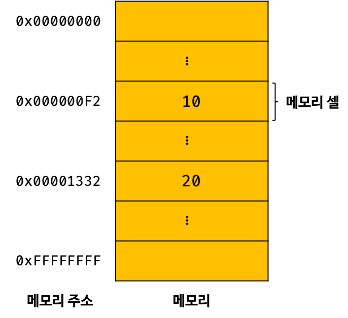
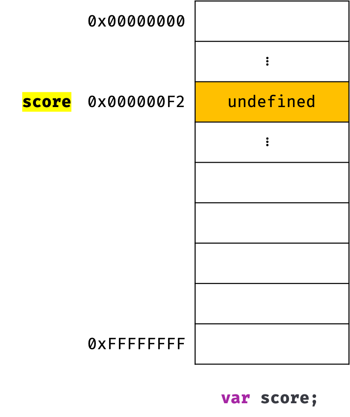
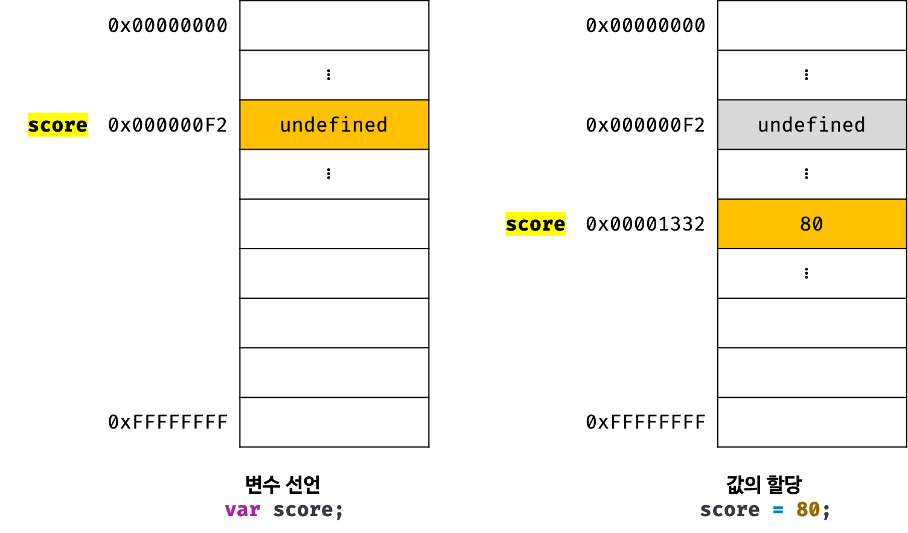
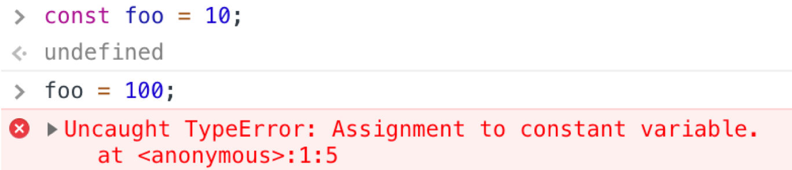
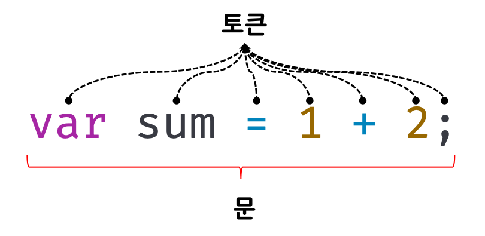
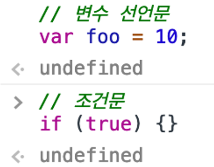
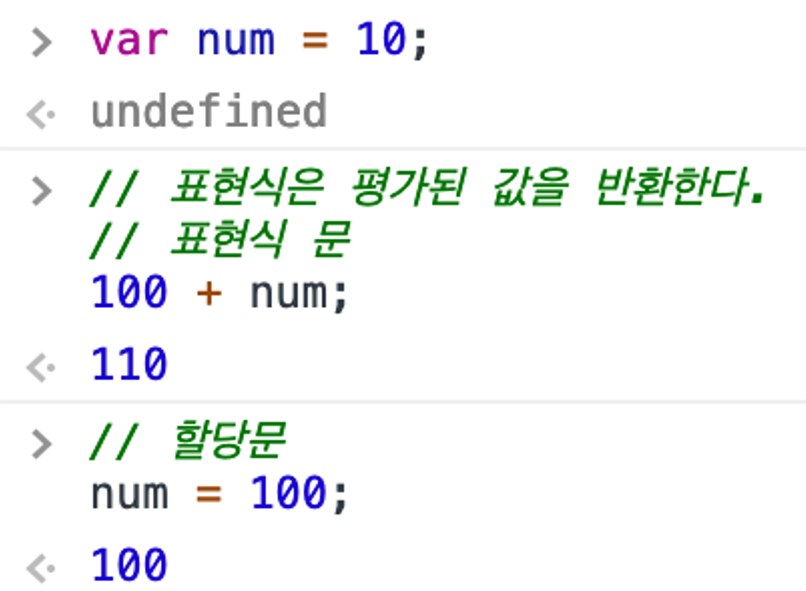

# 변수
## 1.변수란 무엇인가?왜 필요한가?

* 변수는 데이터를 관리하기위한 핵심 개념

* 컴퓨터는 사람을 모텔로 디자인되었기 때문에 사람과 유사하게 동작함.
* 자바스크립트를 해석하고 실행하는 자바스크립트 엔진도 사람과 유사하게 자바스크립트 코드를 실행
* 자바스크립트 엔진이 자바스크립트 코드를 계산(평가, evaluation)하려면 먼저 기호(리터럴과 연산자)의 의미를 알고 있어야 하	며 식(표현식, expression)의 의미도 해석(파싱, parsing)할 수 있어야 한다.
* 자바스크립트 엔진이 식의 의미를 해석하면 연산을 수행하기 위해 먼저 연산자의 좌변과 우변의 숫자 값,즉 피연산자(operand)를 	기억한다
* 컴퓨터는 연산(CPU)과 기억(메모리)을 수행하는 부품이 나눠져 있음.
* 메모리는 데이터를 저장할 수 있는 메모리 셀(memory cell)의 집합체.
* 메모리 셀 하나의 크기는 1바이트(8비트)이며, 컴퓨터는 메모리 셀의 크기로 데이터를 저장(write)하거나 읽어(read)들인다.
---

* 각 셀은 고유의 메모리 주소를 갖는다.

* 메모리 주소는 메모리 공간의 위치를 나타내며, 0부터 시작해서 메모리의 크기만큼 정수로 표현.
* 4GB 메모리는 0부터 4,294,967,295(0x00000000 ~ 0xFFFFFFFF)까지의 메모리 주소를 갖음.
* 컴퓨터는 모든 데이터를 2진수로 처리
* 메모리에 저장되는 데이터는 데이터의 종류(숫자, 텍스트, 이미지, 동영상 등)와 상관없이 모두 2진수로 	저장
* 연산 결과가 메모리에 저장 되었지만 재사용 할 수는 없다.
* 만약 재사용 하고싶다면 메모리 주소를 통해 저장된 메모리 공간에 직접 접근해야한다.(치명적 오류를 	일으킬 수도 있음)
* 자바스크립트는 개발자의 직접적인 메모리 제어를 허용하지 않음
* 프로그래밍 언어는 기억하고 싶은 값을 메모리에 저장하고, 저장된 값을 읽어 들여 재사용하기 위해 변수	라는 메커니즘을 제공
* 변수(variable)는 하나의 값을 저장하기 위해 확보한 메모리 공간 자체 또는 그 메모리 공간을 식별하기	위해 붙인 이름을 말함
---
* 변수에 여러 개의 값을 저장하는 방법
	변수는 하나의 값을 저장하기 위한 메커니즘이다. 여러 개의 값을 저장하려면 여러 개의 변수를 사용해야 	한다. 단, 배열이나 객체 같은 자료구조를 사용하면 관련이 있는 여러 개의 값을 그룹화해서 하나의 값처럼 	사용
```javaScript

  // 변수는 하나의 값을 저장하기 위한 수단이다.

var userId = 1;
var userName = 'Lee';

// 객체나 배열 같은 자료구조를 사용하면 여러 개의 값을 하나로 그룹화해서 하나의 값처럼 사용할 수 있다.
var user = { id: 1, name: 'Lee' };

var users = [
  { id: 1, name: 'Lee' },
  { id: 2, name: 'Kim' }
];
  
```
---
* 연산을 통해 생성된 값 30은 메모리 공간에 저장된다. 이때 메모리 공간에 저장된 값 30을 다시 읽어 들	여 재사용할 수 있도록 값이 저장된 메모리 공간에 상징적인 이름을 붙인 것이 바로 변수다.
---
---
.png)
* 메모리 공간에 저장된 값을 식별할 수 있는 고유한 이름을 변수 이름이라고 함.

* 변수에 저장된 값을 변수 값이라고 함.
* * 변수에 저장하는것을 할당(assignment 대입, 저장)
  * 변수에 저장된 값을 읽어 들이는 것을 참조(reference)
* 변수 이름은 사람을 위해 사람이 이해할 수 있는 언어로 값이 저장된 메모리 공간에 붙인 상징적인 이름
* 변수 이름을 사용해 참조를 요청하면 자바스크립트 엔진은 변수 이름과 매핑(연결)된 메모리 주소를 통해 메모리 공간에 접근해서 저장된 값을 반환함.
* 사람이 이해할 수 있는 언어로 명명한 변수 이름을 통해 변수에 저장된 값의 의미를 명확히함.
* 변수에 저장된 값의 의미를 파악할 수 있는 변수 이름은 가독성을 높임

## 식별자
* 변수이름 = 식별자(identifier)

* 식별자는 어떤 값을 구별해서 식별할 수 있는 고유한 이름
* 식별자는 어떤 값이 저장되어 있는 메모리 주소를 기억(저장)해야함.
* 식별자는 값이 저장되어 있는 메모리 주소와 매핑 관계를 맺으며, 매핑 정보도 메모리에 저장되어야함.
* 식별자는 값이 아니라 메모리 주소를 기억하고 있음.
* 식별자라는 용어는 변수 이름뿐만 아니라 변수, 함수, 클래스 등의 이름도 식별자가 될 수 있다.
* 메모리 상에 존재하는 어떤 값을 식별할 수 있는 이름은 모두 식별자(자바스크립트 함수는 값이다).
* 변수, 함수, 클래스 등의 이름과 같은 식별자는 네이밍 규칙을 준수해야 하며, 선언(declaration)에 의해 자바스크립트 엔진에 식별자의 존재를 알림.

## 변수 선언

* 변수 선언(variable declaration)이란 변수를 생성하는 것

* 값을 저장하기 위한 메모리 공간을 확보(allocate)하고 변수 이름과 확보된 메모리 공간의 주소를 연결(name binding)해서 값을 저장할 수 있게 준비하는 것
* 변수 선언에 의해 확보된 메모리 공간은 확보가 해제(release)되기 이전까지는 누구도 확보된 메모리 공간을 사용할 수 없도록 보호되므로 안전하게 사용할 수 있음.
* 변수를 사용하려면 반드시 선언이 필요함.(var, let, const)키워드를 사용.
* ES6에서 let, const 키워드가 도입되기 이전까지 var 키워드는 자바스크립트에서 변수를 선언할 수 있는 유일한 키워드
* 키워드(keyword)
  * 키워드는 자바스크립트 코드를 해석하고 실행하는 자바스크립트 엔진이 수행할 동작을 규정한 일종의 명령어다. 자바스크립트 엔진은 키워드를 만나면 자신이 수행해야 할 약속된 동작을 수행한다. 예를 들어, var 키워드를 만나면 자바스크립트 엔진은 뒤에 오는 변수 이름으로 새로운 변수를 선언함
  ---
   

* 변수를 선언한 이후, 아직 변수에 값을 할당하지 않았다. 따라서 변수 선언에 의해 확보된 메모리 공간은 비어 있을 것으로 생각할 수 있으나 확보된 메모리 공간에는 자바스크립트 엔진에 의해 undefined라는 값이 암묵적으로 할당되어 초기화된다. 이것은 자바스크립트의 독특한 특징

* undefined
  * undefined는 자바스크립트에서 제공하는 원시 타입의 값(primitive value)
  ---

* 자바스크립트 엔진은 변수선언을 2단계에 거쳐 수행

  * 선언단계:변수 이름을 등록해서 자바스크립트 엔진에 변수의 존재를 알림

  * 초기화 단계:값을 저장하기 위한 메모리 공간을 확보하고 암묵적으로 undefined를 할당해 초기화함.

* * 변수이름을 비롯한 모든 식별자는 실행 컨텍스트에 등록
실행 컨텍스트(excution context)는 자바스크립트 엔진이 소스코드를 평가하고 실행하기 위해 필요한 환경을 제공하고 코드의 실행 결과를 실제로 관리하는 영역

  * 자바스크립트 엔진은 실행 컨텍스트를 통해 식별자와 스코프를 관리
  * 변수 이름과 변수 값은 실행 컨텍스트 내에 키/값(key/value)형식인 객체로 등록되어 관리

* var 키워드를 사용한 변수 선언은 선언 단계와 초기화 단계가 동시에 진행

* var score; 는 선언 단계를 통해 변수 이름 score를 등록하고, 초기화 단계를 통해 score변수에 암묵적으로 undefined를 할당해 초기화함.

* 일반적으로 초기화(initialization)란 변수가 선언된 이후 최초로 값을 할당하는것

* var 키워드로 선언한 변수는 undefined로 암묵적인 초기화가 자동 수행

* var키워드로 선언한 변수는 어떠한 값도 할당하지 않아도 undefined라는 값을 갖는다.

* 초기화 단계를 거치지 않으면 확보된 메모리 공간에 이전에 사용했던 값이 남아 있을 수 있음
이러한 값을 쓰레기 값(garbage value)이라 함.

* 메모리 공간을 확보한 다음, 값을 할당하지 않은 상태에서 곧바로 변수 값을 참조하면 쓰레기 값이 나올 수 있다. 자바스크립트의 var 키워드는 암묵적으로 초기화를 수행하므로 이러한 위험으로부터 안전

## 변수 선언의 실행 시점과 변수 호이스팅
```javaScript
console.log(score); // undefined

var score; // 변수 선언문
```

그 이유는 변수 선언이 소스코드가 한 줄씩 순차적으로 실행되는 시점, 즉 런타임(runtime)이 아니라 그 이전 단계에서 먼저 실행되기 때문이다.
* 변수 선언문보다 변수를 참조하는 코드가 앞에 있다. 자바스크립트 코드는 인터프리터에 의해 한 줄씩 순차적으로 실행되므로 `console.log(score);`가 가장 먼저 실행되고 순차적으로 다음 줄에 있는 코드를 실행한다. 따라서 `console.log(score);`가 실행되는 시점에는 아직 `score` 변수의 선언이 실행되지 않았으므로 참조 에러(ReferenceError)가 발생할 것처럼 보인다. 하지만 참조 에러가 발생하지 않고 undefined가 출력된다.

* 소스코드 실행을 위한 준비 단계인 소스코드의 평가 과정에서 자바스크립트 엔진은 변수 선언을 포함한 모든 선언문(변수 선언문, 함수 선언문 등)을 소스코드에서 찾아내 먼저 실행

* 소스코드의 평가 과정이 끝나면 변수 선언을 포함한 모든 선언문을 제외하고 소스코드를 한 줄씩 순차적으로 실행

* 자바스크립트 엔진은 변수 선언이 소스코드의 어디에 있든 상관없이 다른 코드보다 먼저 실행한다. 따라서 변수 선언이 소스코드의 어디에 위치하는지와 상관없이 어디서든 변수를 참조 할 수 있음.

변수 선언문인 var score;보다 변수를 참조하는 코드인 console.log(score);가 앞에 있다. 만약 코드가 순차적으로 실행되는 런타임에 변수 선언이 실행된다면 console.log(score);가 실행되는 시점에는 아직 변수가 선언되기 이전이므로 위 코드를 실행하면 참조 에러(ReferenceError)가 발생해야 한다. 하지만 undefined가 출력된다.

이는 변수 선언(선언 단계와 초기화 단계)이 소스코드가 순차적으로 실행되는 런타임 이전 단계에서 먼저 실행된다는 증거다. 이처럼 변수 선언문이 코드의 선두로 끌어 올려진 것처럼 동작하는 자바스크립트 고유의 특징을 변수 호이스팅(variable hoisting)이라 한다.

사실 호이스팅은 변수 선언 뿐만이 아니라 var, let, const, function, function*, class 키워드를 사용해서 선언하는 모든 식별자(변수, 함수, 클래스 등)는 호이스팅된다. 모든 선언문은 런타임 이전 단계에서 먼저 실행되기 때문

## 값의 할당

* 변수에 값을 할당(assignment; 대입, 저장)할 때는 할당 연산자(=)를 사용한다. 할당 연산자는 우변의 값을 좌변의 변수에 할당한다.

```javaScript
var score;  // 변수 선언
score = 80; // 값의 할당
```

* 변수 선언과 값의 할당을 다음과 같이 하나의 문(statement)으로 단축 표현할 수도 있다.

```javaScript
var score = 80; // 변수 선언과 값의 할당
```
* 자바스크립트 엔진은 변수 선언과 값의 할당을 하나의 문으로 단축 표현해도 변수 선언과 값의 할당을 2개의 문으로 나누어 각각 실행
(주의할점:변수선언과 값의 할당의 시점이 다름. 변수 선언은 소스코드가 순차적으로 실행되는 시점인 런타임 이전에 먼저 실행되지만 값의 할당은 소스코드가 순차적으로 실행되는 시점인 런타임에 실행된다.)

```javaScript
console.log(score); // undefined

var score;  // ① 변수 선언
score = 80; // ② 값의 할당

console.log(score); // 80
```
* 변수 선언(①)은 런타임 이전에 먼저 실행되고 값의 할당(②)은 런타임에 실행된다. 따라서 score 변수에 값을 할당하는 시점(②)에는 이미 변수 선언이 완료된 상태이며, 이미 undefined로 초기화되어 있다. 따라서 score 변수에 값을 할당하면 score 변수의 값은 undefined에서 새롭게 할당한 숫자 값 80으로 변경(재할당)된다.
변수 선언과 값의 할당을 하나의 문(statement)으로 단축 표현할 수도 있으므로 앞 예제는 다음 예제와 동일하게 동작한다.

```javaScript
console.log(score); // undefined

var score = 80;     // 변수 선언과 값의 할당

console.log(score); // 80
```
* 변수의 선언과 값의 할당을 하나의 문장으로 단축 표현해도 자바스크립트 엔진은 변수의 선언과 값의 할당을 2개의 문으로 나누어 각각 실행한다. 따라서 변수에 undefined가 할당되어 초기화되는 것은 변함이 없다.

---


* 위 그림처럼 변수에 값을 할당할 때는 이전 값 undefined가 저장되어 있던 메모리 공간을 지우고 그 메모리 공간에 할당 값 80을 새롭게 저장하는 것이 아니라 새로운 메모리 공간을 확보하고 그 곳에 할당 값 80을 저장하는 점에 주의
---

## 값의 재할당

```javaScript
var score = 80; // 변수 선언과 값의 할당
score = 90;     // 값의 재할당
```
* var 키워드로 선언한 변수는 값을 재할당할 수 있다.

* 재할당은 현재 변수에 저장된 값을 버리고 새로운 값을 저장하는 것

* var 키워드로 선언한 변수는 선언과 동시에 undefined로 초기화되기 때문에 엄밀히 말하자면 변수에 처음으로 값을 할당하는 것도 사실은 재할당임

* 재할당은 변수에 저장된 값을 다른 값으로 변경

* 만약 값을 재할당할 수 없어서 변수에 저장된 값을 변경할 수 없다면 변수가 아니라 상수(constant)라 한다

* const 키워드
  * S6에서 도입된 const 키워드를 사용해 선언한 변수는 재할당이 금지된다. 즉, const 키워드는 단 한 번만 할당할 수 있는 변수를 선언한다. 따라서 const 키워드를 사용하면 상수를 표현할 수 있다. 하지만 const 키워드는 반드시 상수만을 위해 사용하지는 않는다.

  

  * 변수에 값을 재할당하면 score 변수의 값은 이전 값 80에서 재할당한 값 90으로 변경된다. 처음 값을 할당했을 때와 마찬가지로 이전 값 80이 저장되어 있던 메모리 공간을 지우고 그 메모리 공간에 재할당 값 90을 새롭게 저장하는 것이 아니라 새로운 메모리 공간을 확보하고 그 메모리 공간에 숫자 값 90을 저장한다.

  

  * 현재 score 변수의 값은 90이다. score 변수의 이전 값인 undefined와 80은 어떤 변수도 값으로 갖고 있지 않다. 다시 말해, 어떤 식별자와도 연결되어 있지 않다. 이것은 undefined과 80이 더 이상 필요하지 않다는 것을 의미한다. 아무도 사용하고 있지 않으니 필요하지 않은 것이다. 이러한 불필요한 값들은 가비지 콜렉터에 의해 메모리에서 자동 해제된다. 단, 메모리에서 언제 해제될지는 예측할 수 없다.

* 가비지 콜렉터(garbage collector)
  * 가비지 콜렉터는 애플리케이션이 할당(allocate)한 메모리 공간을 주기적으로 검사하여 더 이상 사용되고 있지 않는 메모리를 해제(release)하는 기능을 말한다. 더 이상 사용되고 있지 않는 메모리란 간단히 말하자면 어떤 식별자도 참조하지 않는 메모리 공간을 의미한다. 자바스크립트는 가비지 콜렉터를 내장하고 있는 매니지드 언어로서 가바지 콜렉터를 통해 메모리 누수(memory leak)를 방지한다.

  * 언매니지드 언어(unmanaged language)와 매니지드 언어(managed language)
    * 프로그래밍 언어는 메모리 관리 방식에 따라 언매니지드 언어와 매니지드 언어로 분류할 수 있다.
C 언어 같은 언매니지드 언어는 개발자가 명시적으로 메모리를 할당하고 해제하기 위해 malloc()과 free() 같은 저수준(low-level) 메모리 제어 기능을 제공한다. 언매니지드 언어는 메모리 제어를 개발자가 주도할 수 있으므로 개발자의 역량에 따라 최적의 성능을 확보할 수 있지만 그 반대의 경우 치명적 오류를 생산할 가능성도 있다.
자바스크립트 같은 매니지드 언어는 메모리의 할당 및 해제를 위한 메모리 관리 기능을 언어 차원에서 담당하고 개발자의 직접적인 메모리 제어를 허용하지 않는다. 즉, 개발자가 명시적으로 메모리를 할당하고 해제할 수 없다. 더 이상 사용하지 않는 메모리의 해제는 가비지 콜렉터가 수행하며, 이 또한 개발자가 관여할 수 없다. 매니지드 언어는 개발자의 역량에 의존하는 부분이 상대적으로 작아져 어느 정도 일정한 생산성을 확보할 수 있다는 장점이 있지만 성능 면에서 어느 정도의 손실은 감수할 수밖에 없다.

## 값의 교환

```javaScript
var x = 1;
var y = 2;

// do something

console.log(x, y); // 2 1
```

## 식별자 네이밍 규칙

* 식별자는 다음과 같은 네이밍 규칙을 준수
  * 식별자는 특수문자를 제외한 문자, 숫자, 언더스코어(_), 달러 기호($)를 포함할 수 있다.
  * 단, 식별자는 특수문자를 제외한 문자, 언더스코어(_), 달러 기호($)로 시작해야 한다. 숫자로 시작하는 것은 허용하지 않는다.
  * 예약어는 식별자로 사용할 수 없다.

* 예약어(reserved word)
  * 예약어는 프로그래밍 언어에서 사용되고 있거나 사용될 예정인 단어를 말한다. 자바스크립트의 예약어는 다음과 같다.

await break case catch class const continue debugger default delete do else enum export extends false finally for function if implements* import in Instanceof interface* let* new null package* private* protected* public* return super static* switch this throw true try typeof var void while with yield*
식별자로 사용 가능하나 Strict Mode에서는 사용 불가

```javaScript
var person, $elem, _name, first_name, val1;
```
* ES5부터 식별자를 만들 때 유니코드 문자를 허용하므로 알파벳 이외의 한글이나 일본어 식별자도 사용할 수 있다. 하지만 알파벳 이외의 유니코드 문자로 명명된 식별자를 사용하는 것은 바람직하지 않으므로 권장하지 않는다.
```javaScript
var 이름, なまえ;
```

* 자바스크립트는 대소문자를 구별하므로 각각 별개의 변수임.

* 변수 이름은 변수의 존재 목적을 쉽게 이해할 수 있도록 의미를 명확히 표현해야함. 좋은 변수이름은 코드이 가독성을 높임
```javaScript
var x = 3;       // NG. x 변수가 의미하는 바를 알 수 없다.
var score = 100; // OK. score 변수는 점수를 의미한다.
```

* 변수 선언에 별도의 주석이 필요하다면 변수의 존재 목적을 명확히 드러내지 못하는것.

* 네이밍 컨벤션(naming convention)은 하나 이상의 영어 단어로 구성된 식별자를 만들 때 가독성 좋게 단어를 한눈에 구분하기 위해 규정한 명명 규칙
```javaScript
// 카멜 케이스 (camelCase)
var firstName;

// 스네이크 케이스 (snake_case)
var first_name;

// 파스칼 케이스 (PascalCase)
var FirstName;

// 헝가리언 케이스 (typeHungarianCase)
var strFirstName; // type + identifier
var $elem = document.getElementById('myId'); // DOM 노드
var observable$ = fromEvent(document, 'click'); // RxJS 옵저버블
```

* 일관성을 유지한다면 어떤 네이밍 컨벤션을 사용해도 좋음.
가장 일반적인 방식은 변수나 함수의 이름에는 카멜 케이스를 사용하고 생성자 함수, 클래스의 이름에는 파스칼 케이스를 사용하는 것

# 표현식과 문

* 개념을 이해한다는 것은 바로 용어를 정확히 이해하고 설명할 수 있다는 것

## 값
* 값(value)은 식(표현식, expression)이 평가(evaluate)되어 생성된 결과를 말한다. 평가란 식을 해석해서 값을 생성하거나 참조하는 것을 의미
```javaScript
// 10 + 20은 평가되어 숫자 값 30을 생성한다.
10 + 20; // 30
```

* 모든 값은 데이터 타입을 가지며, 메모리에 2진수, 즉 비트(bit)의 나열로 저장
* 메모리에 저장된 값은 데이터 타입에 따라 다르게 해석될 수 있다. 예를 들어, 메모리에 저장된 값 0100 0001을 숫자로 해석하면 65이지만 문자로 해석하면 ‘A’이다.
* 변수는 하나의 값을 저장하기 위해 확보한 메모리 공간 자체 또는 그 메모리 공간을 식별하기 위해 붙인 이름이라고 했다. 따라서 변수에 할당되는 것은 값
```javaScript
// 변수에는 10 + 20이 평가되어 생성된 숫자 값 30이 할당된다.
var sum = 10 + 20;
```
* 위 예제의 sum 변수에 할당되는 것은 10 + 20이 아니라 10 + 20이 평가된 결과인 숫자 값 30이다. 즉, 변수 이름 sum이 기억하는 메모리 공간에 저장된 것은 10 + 20이 아니라 값 30이다. 따라서 10 + 20은 할당 이전에 평가되어 값을 생성해야 한다.

값은 다양한 방법으로 생성할 수 있다. 위 예제처럼 식으로 생성할 수도 있지만 가장 기본적인 방법은 리터럴을 사용하는 것

## 리터럴
* 리터럴(literal)은 사람이 이해할 수 있는 문자 또는 약속된 기호를 사용해 값을 생성하는 표기 방식(notaion)을 말함


* 리터럴은 사람이 이해할 수 있는 문자(아라비아 숫자, 알파벳, 한글 등) 또는 미리 약속된 기호(‘’, “”, ., [], {}, // 등)로 표기한 코드다. 자바스크립트 엔진은 코드가 실행되는 시점인 런타임(runtime)에 리터럴을 평가해 값을 생성한다. 즉, 리터럴은 값을 생성하기 위해 미리 약속한 표기법

* 리터럴을 사용하면 다양한 종류(data type)의 값을 생성할 수 있음
```javaScript
// 정수 리터럴
100
// 부동소수점 리터럴
10.5
// 2진수 리터럴(0b로 시작)
0b01000001
// 8진수 리터럴(ES6에서 도입. 0o로 시작)
0o101
// 16진수 리터럴(ES6에서 도입. 0x로 시작)
0x41

// 문자열 리터럴
'Hello'
"World"

// 불리언 리터럴
true
false

// null 리터럴
null

// undefined 리터럴
undefined

// 객체 리터럴
{ name: 'Lee', address: 'Seoul' }

// 배열 리터럴
[ 1, 2, 3 ]

// 함수 리터럴
function() {}

// 정규표현식 리터럴
/[A-Z]+/g
```

## 표현식
* 표현식(expression)은 값으로 평가될 수 있는 문(statement)이다. 즉, 표현식이 평가되면 새로운 값을 생성하거나 기존 값을 참조한다.
* 리터럴도 값으로 평가되기 때문에 표현식이다.

* 변수 식별자를 참조하면 변수 값으로 평가됨. 식별자 참조는 값을 생성하지는 않지만 값으로 평가되므로 표현식이다.

* 값으로 평가되는 문은 모두 표현식이다.
```javaScript
// 리터럴 표현식
10
'Hello'

// 식별자 표현식(선언이 이미 존재한다고 가정)
sum
person.name
arr[1]

// 연산자 표현식
10 + 20
sum = 10
sum !== 10

// 함수/메서드 호출 표현식(선언이 이미 존재한다고 가정)
square()
person.getName()
```
* 문법적으로 값이 위치할 수 있는 자리에는 표현식도 위차할 수 있다.

## 문
* 문과 표현식을 구별하고 해석할 수 있으면 자바스크립트 엔진의 입장에서 코드를 읽을 수 있고 실행 결과를 예측하는데 도움이 된다.
* 문(statement)은 프로그램을 구성하는 기본 단위이자 최소 실행 단위, 문의 집합으로 이뤄진 것이 바로 프로그램이며, 문을 작성하고 순서에 맞게 나열하는 것이 프로그래밍
* 문은 여러 토근으로 구성됨.
* 토큰(token)이란 문법적인 의미를 가지며, 문법적으로 더 이상 나눌 수 없는 코드의 기본 요소를 의미(키워드, 식별자, 연산자, 리터럴, 세미콜론(;)이나 마침표(.) 등의 특수 기호는 문법적인 의미를 가지며, 문법적으로 더 이상 나눌 수 없는 코드의 기본 요소)

* 문=명령문
* 문은 컴퓨터에 내리는 명령
* 문은 선언문,할당문,조건문,반복문 등으로 구분함.
```javaScript
// 변수 선언문
var x;

// 표현식 문(할당문)
x = 5;

// 함수 선언문
function foo () {}

// 조건문
if (x > 1) { console.log(x); }

// 반복문
for (var i = 0; i < 2; i++) { console.log(i); }
```

## 세미콜론과 세미콜론 자동 삽입 기능

* 세미콜론(;)은 문의 종료를 나타낸다.
* 자바스크립트 엔진은 세미콜론으로 문이 종료한 위치를 파악하고 순차적으로 하나씩 문을 실행
* 0개 이상의 문을 중괄호로 묶은 코드 블록({...})뒤에는 세미콜론을 붙이지 않음(예: if문,for문, 함수 등)
* 코드블록은 언제나 문의 종료를 의마하는 자체 종결성(self closing)을 갖기 때문
* 문의 끝에 붙이는 세미콜론은 생략도 가능하다. 하지만 프론트쪽은 붙이는게 대세

## 표현식인 문과 표현식이 아닌 문
* 표현식은 문의 일부일 수도 있고 그 자체로 문이 될 수 있음
```javascript
// 변수 선언문은 값으로 평가될 수 없으므로 표현식이 아니다.
var x;
// 1, 2, 1 + 2, x = 1 + 2는 모두 표현식이다.
// x = 1 + 2는 표현식이면서 완전한 문이기도 하다.
x = 1 + 2;
```
* 표현식과 문은 비슷해서 구별하기 어려울 수 있음
* 표현식인 문은 값으로 평가됨
* 표현식이 아닌 문은 값으로 평가 될 수 없음
* 표현식인 문과 표현식이 나닌 문을 구별하는 가장 간단하고 명료한 방법은 변수에 할당해 보는 것

```javascript
// 변수 선언문은 표현식이 아닌 문이다.
var x;

// 할당문은 그 자체가 표현식이지만 완전한 문이기도 하다. 즉, 할당문은 표현식인 문이다.
x = 100;
```
```javascript
// 표현식이 아닌 문은 값처럼 사용할 수 없다.
var foo = var x; // SyntaxError: Unexpected token var
```
```javascript
// 표현식인 문은 값처럼 사용할 수 있다
var foo = x = 100;
console.log(foo); // 100
```
* 완료값(completion value)
  * 크롬 개발자 도구에서 표현식이 아닌 문을 실행하면 언제나 undefined를 출력한다. 이를 완료값이라 한다. 완료값은 표현식의 평가 결과가 아니다. 따라서 다른값과 같이 변수에 할당할 수 없고 참조할 수도 없다.

개발자 도구에서 표현식이 아닌 문을 실행하면 완료값 undefined출력

* 크롬 개발자 도구에서 표현식인 문을 실행하면 언제나 평가된 값을 반환한다.

표현식인 문은 평가된 값을 반환한다.